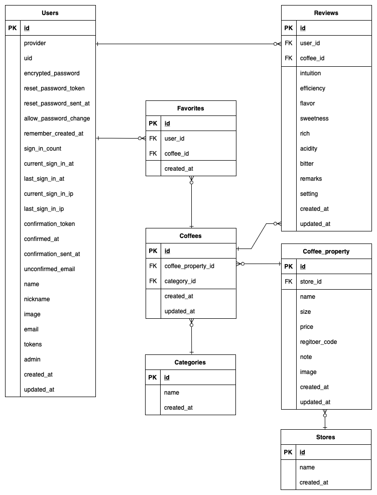

# README

### アプリ名「this coffee!!」

あなたの最適なコーヒーライフを手助けします。

# 開発言語

バックエンド

- Ruby 3.0.1
- Ruby on Rails 6.1.7

フロントエンド(https://github.com/tomoaki198211/this_coffee_front)

- Typescript 4.9.4
- Vue.js 3.2.45

# インフラ

- AWS(EC2/S3/Route53/CloudFront)
- docker
- docker-compose
- Nginx/puma

# インフラ図


# 使用技術

Rails と Vue.js を用いた SPA

バックエンド

Ruby on Rails

- devise（gem/ログインで使用）
- devise_token_auth（gem/認証処理をトークンで使用）
- rack-cors(gem/クロスオリジンで使用)
- typoeus(gem/リクエスト処理/Twitter API V2 による投稿取得で使用))

フロントエンド

Vue.js

- Vue router(ライブラリ/フロントエンドのルーティングに使用)
- pinia(ライブラリ/データのストアとして使用)
- Vuetify(ライブラリ/画面の装飾として使用)
- vue-chartjs(ライブラリ/レーダーチャートを表示する為に使用)

#テスト

- RSpec

# 実行手順

```bash
$ git clone https://github.com/tomoaki198211/this_coffee_api.git
$ bundle install
$ yarn install
$ cd this_coffee_api
$ rails db:create && rails db:migrate
$ rails s
```

フロントエンドに関しては開発中に動作確認後に追記

# カタログ設計

https://docs.google.com/spreadsheets/d/1doVEqBQa4o_UpcBmZ5tsXWE40SP6KND7jQxpvEGkHqM/edit?usp=sharing

# テーブル定義書

https://docs.google.com/spreadsheets/d/1doVEqBQa4o_UpcBmZ5tsXWE40SP6KND7jQxpvEGkHqM/edit?usp=sharing

# ワイヤーフレーム（PC）

[https://cacoo.com/diagrams/EtcrWRiydVRjRjfK/DDD5D](https://cacoo.com/diagrams/EtcrWRiydVRjRjfK/DDD5D)

# ワイヤーフレーム（スマートフォン）

[https://cacoo.com/diagrams/8eHVy3nKfS463JZD/DDD5D](https://cacoo.com/diagrams/8eHVy3nKfS463JZD/DDD5D)

# ER 図



# 画面遷移図


